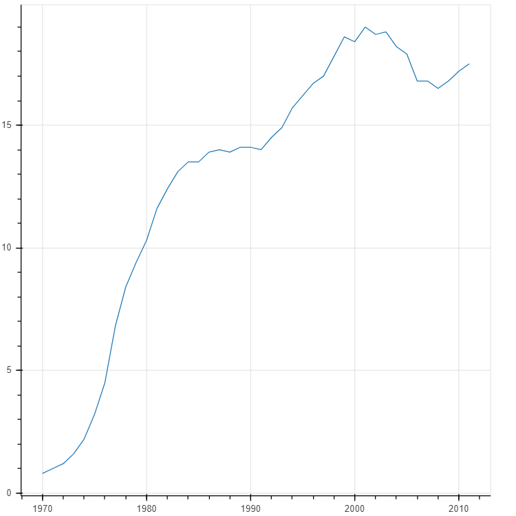

# Bokeh-Plotting-Education-Data
To make a graph that shows the percentage of women who have received a bachelor's degree in **Engineering** over the years in USA. The graph has been constructed using the Bokeh library.
  

The Python code is stored in the Jupyter Notebook as **Plotting_Education_Data.ipynb**. The graph will be saved in the **women.html** file and the snapshot is given below.
  

**Snapshot**
  

